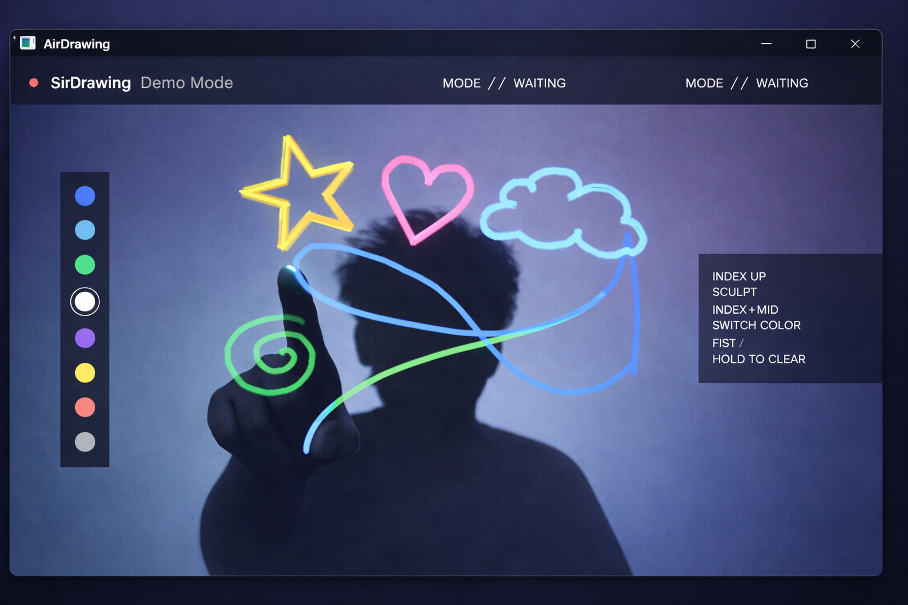

# 🎨 AirSculpt Pro (AirDrawing)
### High-Fidelity Gesture-Controlled Digital Canvas

AirSculpt Pro is a real-time computer vision application that transforms hand gestures into a seamless digital painting experience.

Built using **MediaPipe** and **OpenCV**, the system enables a fully touchless drawing interface with a professional-style HUD and signal smoothing for stable and fluid interaction.

---

## 🚀 Technical Highlights

### ✨ EMA Smoothing
Implements **Exponential Moving Average (EMA)** filtering to stabilize pointer coordinates and eliminate jitter from raw webcam tracking.

### 🧊 Modern Glass UI
A semi-transparent, non-intrusive interface featuring:
- Dynamic toolbars  
- Real-time system status  
- Smooth drawing pipeline  

### 🧠 Intelligent Gesture Mapping

| Gesture | Action |
|----------|--------|
| ☝ Index Finger Up | **SCULPT** – Draw on the canvas |
| ✌ Index + Middle Up | **PALETTE** – Cycle through colors |
| ✊ Closed Fist (40-frame hold) | **PURGE** – Clear canvas safely |
| ✋ Any Other | **IDLE** – Cursor movement only |

### 🎨 Dynamic Palette
An adaptive sidebar supporting 8 cyberpunk-inspired neon colors.

---

## 📸 Demo

<p align="center">
  
</p>

---

## 🛠️ Project Structure

```
AirDrawing/
│
├── AirDrawing.py          # Core engine and UI logic
├── hand_landmarker.task   # Pre-trained MediaPipe model
├── requirements.txt       # Python dependencies
├── assets/
│   └── demo.png
└── .gitignore             # Excludes venv and unnecessary files
```

---

## 💻 Setup & Installation

### 1️⃣ Clone Repository

```bash
git clone https://github.com/Abhinand-krishna-R/AirDrawing.git
cd AirDrawing
```

### 2️⃣ Install Dependencies

```bash
pip install -r requirements.txt
```

### 3️⃣ Run Application

```bash
python AirDrawing.py
```

---

## 📖 Usage Guide

- Stay within **1–2 meters** of your webcam for optimal tracking.
- Ensure good lighting for best gesture recognition.
- Use gestures listed above to interact with the canvas.

---

## 🛠️ Built With

- **OpenCV** – Computer Vision Framework  
- **MediaPipe** – Real-time Hand Tracking  
- **NumPy** – Efficient Matrix Manipulation  

---

## 👤 Author

**Abhinand Krishna R**
